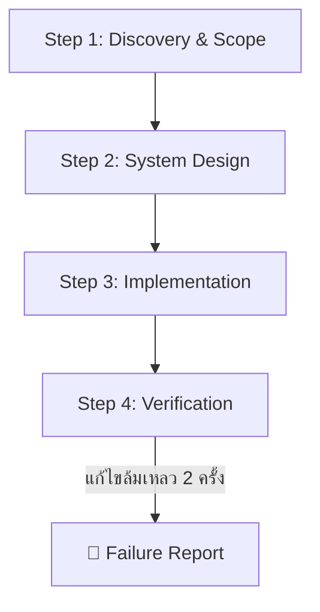

# 🧠 Agent Skill & Master Configuration Framework

> **Global AI Agent Rules & Architecture Framework for Modern Software Engineering**
> สถาปัตยกรรม 3 ชั้นควบคุม AI Coding Agent (Google Antigravity, Cursor, Claude Code, Windsurf ฯลฯ) เพื่อการพัฒนาซอฟต์แวร์ระดับ Production-Ready

 

---

## 📌 ภาพรวมโปรเจกต์ (Project Overview)

**`agent-skill`** คือกรอบควบคุมพฤติกรรม (Behavioral Framework) และชุดสถาปัตยกรรมกฎระเบียบ (3-Tier Rule Architecture) สำหรับ AI Coding Agent ถูกออกแบบขึ้นเพื่อแก้ปัญหาพฤติกรรมของ AI ทั่วไป และยกระดับ AI ให้กลายเป็น **Pragmatic Engineering Partner** ที่ทำงานร่วมกับโปรแกรมเมอร์ได้อย่างมีประสิทธิภาพ ปลอดภัย และมีมาตรฐานสูงสุด

### 🎯 ปัญหาที่โปรเจกต์นี้เข้ามาแก้ไข (Problem & Solution)

| ❌ ปัญหาของ AI ทั่วไป (Generic AI Agent) | ✅ สิ่งที่ `agent-skill` บังคับให้ทำ (Pragmatic Agent) |
|---|---|
| **เป็น "Yes-Man":** เออออตามผู้ใช้แม้ไอเดียจะเสี่ยงหรือ Over-engineered | **Pragmatic Challenger:** กล้าท้าทาย ค้านอย่างมีเหตุผล พร้อมนำเสนอ Pros/Cons/Trade-offs |
| **Preamble & Fluff:** ชอบพูดคำทักทายไร้สาระ ("ได้ครับ", "ยินดีครับ") และเกริ่นยืดยาว | **Action-First (BLUF):** สรุปสาระสำคัญไว้ที่บรรทัดแรกสุด (Bottom Line Up Front) ตัดคำไร้สาระออก 100% |
| **Hallucination & Guesswork:** มโนชื่อไฟล์ หรือแอบข้ามไฟล์ที่หาไม่เจอ | **Zero Hallucination:** หากข้อมูลไม่ชัดเจนหรือไฟล์หาย จะ **"หยุดถามทันที"** ห้ามเดาเอาเอง |
| **Code Spaghetti / Buggy RBAC:** สับสนเรื่องการจัดการสิทธิ์หลายบทบาท หรือทำให้เกิด Hydration Error | **System Blueprints:** มีพิมพ์เขียวมาตรฐานสำเร็จรูป (`blueprints/`) ป้องกันบั๊กตั้งแต่ระดับโครงสร้าง |
| **แก้บั๊กวนลูปไม่จบ:** แก้พังวนซ้ำไปเรื่อยๆ โดยไม่รายงานปัญหาที่แท้จริง | **Failure Report Protocol:** หากแก้ Error ล้มเหลวครบ 2 ครั้ง ต้องหยุดและส่งรายงาน Root Cause ทันที |

---

## 🏛️ สถาปัตยกรรมระบบ 3 ชั้น (The 3-Tier Rule Architecture)

ระบบถูกจัดระเบียบใหม่ตามหลัก Separation of Concerns เพื่อความเรียบง่ายและไม่ซ้ำซ้อน:

```text
agent-skill/
├── AGENTS.md                   # 🧠 [Tier 1: AI Brain & Orchestration] แม่บทควบคุมพฤติกรรมและ Workflow 4 ขั้น
├── README.md                   # 📖 คู่มือการใช้งานและคำแนะนำสำหรับนักพัฒนา
├── .gitignore                  # 🛡️ มาตรฐาน Ignore ป้องกัน Secrets & AI Artifacts
│
├── rules/                      # 📜 [Tier 2: Engineering Standards] กฎคุณภาพ 6 เสาหลัก
│   ├── 01-security-auth.md     # 🥇 ความปลอดภัย, Secrets, CSRF, CORS & Hard Gates
│   ├── 02-coding-standards.md  # 🥈 Strict TypeScript, Try-Catch, Naming & Git Conventions
│   ├── 03-system-architecture.md# 🥉 Pragmatic Monolith, RESTful API Standards & Presets
│   ├── 04-database-design.md   # Prisma Schema, Migrations & Safe Seeding Dispatcher
│   ├── 05-ux-ui-design.md      # Component Layering 4 ชั้น, Tailwind CSS & Performance
│   └── 06-testing-devops.md    # Vitest/Playwright, Docker Multi-Stage & Structured Logging
│
├── skills/                     # 🧰 [Specialized AI Skills] ชุดสกิลผู้เชี่ยวชาญเฉพาะด้าน 7 ตัว
│   ├── codebase-cartographer/  # 🧭 สำรวจและรื้อฟื้นบริบทโปรเจกต์เก่าที่ทิ้งไว้นาน
│   ├── database-architect/     # 🗄️ จูน Query, Prisma Index & ป้องกัน Deadlock
│   ├── design-taste-frontend/  # 🎨 คุมโทนสีพรีเมียม (HSL) & Anti-Cliché UI
│   ├── docker-devops-master/   # 🐳 Multi-Stage Dockerfile & GitHub Actions CI/CD
│   ├── impeccable-audit/       # 🔍 Audit โค้ด, ความปลอดภัย (OWASP) & a11y
│   ├── sandbox-testing/        # 🧪 รัน Test Suite อัตโนมัติ & RBAC Persona Matrix
│   └── typescript-wizard/      # 🧙‍♂️ Strict TypeScript ไร้ Any สไตล์ Matt Pocock
│
├── scripts/
│   ├── scan-context.js         # ⚡ สคริปต์ Auto-Scan สร้างแผนผังบริบทโปรเจกต์ใน 1 วินาที
│   └── setup-git-shield.js     # 🛡️ สคริปต์ติดตั้งระบบป้องกัน .env และ Secrets Leak อัตโนมัติ
│
└── templates/                  # 📐 [Tier 3: Blueprints & Context Maps] พิมพ์เขียวพร้อมใช้
    ├── AI-Context-Index.md     # Single Source of Truth สรุปบริบทโปรเจกต์สำหรับ AI
    ├── gitignore-production.md # พิมพ์เขียว .gitignore มาตรฐานแยก AI & Secrets
    └── blueprints/
        ├── rbac-multi-role.md  # พิมพ์เขียวระบบ Multi-Role, 1-Click Quick Login & Dual-Layer Guards
        └── idempotent-webhook-receiver-with-hmac-signature.md # พิมพ์เขียว Webhook Receiver ปลอดภัย
```

---

### 📋 ตารางสรุป 6 เสาหลักมาตรฐานวิศวกรรม (Tier 2 Matrix)

| โมดูล | ขอบเขตหน้าที่ | หัวใจสำคัญ |
|---|---|---|
| **[`01-security-auth.md`](./rules/01-security-auth.md)** | Security & Protection | Zero Trust, `<secret:VAR_NAME>`, CSRF (Nuxt/Next.js), CORS Whitelist, Dev 404 Hard Gate |
| **[`02-coding-standards.md`](./rules/02-coding-standards.md)** | Code Quality & Git | Strict TS (No `any`), Try-Catch Log Origin, Conventional Commits, Solo-Dev Push Rule |
| **[`03-system-architecture.md`](./rules/03-system-architecture.md)** | System & API Design | Pragmatic Monolith, Ask before Diagram, RESTful Standards, Zod Validation, Idempotency |
| **[`04-database-design.md`](./rules/04-database-design.md)** | Database & Seeding | Prisma Safe Migrations, Central Seed Dispatcher (`seed.ts`), Soft Delete Cascade |
| **[`05-ux-ui-design.md`](./rules/05-ux-ui-design.md)** | Frontend & UX/UI | Component 4 Layers, Mobile-first Tailwind, Nuxt UI & Shadcn, Bundle < 200KB |
| **[`06-testing-devops.md`](./rules/06-testing-devops.md)** | QA, Docker & Logging | Vitest, Test DB Isolation, Docker Multi-Stage, GitHub Actions CI/CD, Structured Pino Logs |

---

### 🧰 ชุดสกิลผู้เชี่ยวชาญเฉพาะด้าน 7 ตัว (Specialized Skills)

| หมวดหมู่ | Skill Name | ลิงก์ไฟล์ | หน้าที่สำคัญ |
|---|---|---|---|
| 🧭 **Onboarding & Exploration** | `codebase-cartographer` | [`SKILL.md`](./skills/codebase-cartographer/SKILL.md) | รื้อฟื้นและ Onboarding โปรเจกต์เก่า สแกน Git, Prisma, Routes และออกรายงาน **Project Executive Brief** |
| 🎨 **Frontend & UI/UX** | `design-taste-frontend` | [`SKILL.md`](./skills/design-taste-frontend/SKILL.md) | คุมโทนสีพรีเมียม (สัดส่วน 60-30-10 & HSL), Typography tracking, และหลีกเลี่ยง UI เชยๆ |
| 🧙‍♂️ **Code Quality & Typing** | `typescript-wizard` | [`SKILL.md`](./skills/typescript-wizard/SKILL.md) | สไตล์ **Matt Pocock** (Total TypeScript), Discriminated Unions, Zod Inference, กำจัด `any` 100% |
| 🗄️ **Database & Performance** | `database-architect` | [`SKILL.md`](./skills/database-architect/SKILL.md) | แก้ปัญหา N+1 Query ด้วย `include`/`select`, วาง Index (`@@index`), ป้องกัน Deadlock ด้วย `$transaction` |
| 🧪 **QA & Verification** | `sandbox-testing` | [`SKILL.md`](./skills/sandbox-testing/SKILL.md) | สร้าง Sandbox Test Suite รันเทสต์เร็วใน 1 วินาที, ตรวจสอบ RBAC Matrix ทุก Role, และทำ DB Rollback |
| 🔍 **Audit & Pre-flight** | `impeccable-audit` | [`SKILL.md`](./skills/impeccable-audit/SKILL.md) | ตรวจสอบ Accessibility (WCAG 2.1 AA), สแกนช่องโหว่ OWASP/IDOR, และดักจับ Monolithic Components |
| 🐳 **DevOps & Infrastructure** | `docker-devops-master` | [`SKILL.md`](./skills/docker-devops-master/SKILL.md) | Multi-stage Dockerfile ขนาดจิ๋ว ปลอดภัยด้วย Non-root user, Docker Compose, และ GitHub Actions CI/CD |

---

## 🛡️ System Blueprints & Production-Ready Patterns (Tier 3)

จุดเด่นของ Framework นี้คือการมี **System Blueprints (`templates/blueprints/`)** ซึ่งเป็นพิมพ์เขียวสถาปัตยกรรมระดับระบบ เพื่อแก้ปัญหาข้อผิดพลาดทางเทคนิคที่พบบ่อยตั้งแต่ระดับโครงสร้าง:

### 🌟 Multi-Role & RBAC Blueprint ([`rbac-multi-role.md`](./templates/blueprints/rbac-multi-role.md))
พิมพ์เขียวสำหรับระบบที่มีหลายบทบาทหน้าที่ (เช่น Admin, Manager, Staff) ที่ฝังกลไกตัดบั๊กสำคัญ 4 ด้าน:
1. **🌱 Safe Seeding Dispatcher:** สคริปต์ `prisma/seed.ts` ทำหน้าที่เป็น Main Dispatcher แยกการ Seed ข้อมูลจำลอง (`dev.seed.ts`) ออกจากบทบาทระบบ (`prod.seed.ts`) ป้องกันข้อมูลทดสอบและรหัสผ่านง่ายๆ หลุดเข้า Production Database
2. **⚡ Hydration-Safe 1-Click Login:** ปุ่มลัดล็อกอินสำหรับโหมด Dev/QA ที่รองรับ `<ClientOnly>` และ Feature Flag `ENABLE_DEV_LOGIN` เพื่อเปิดใช้งานบน Staging ได้อย่างปลอดภัย และไม่ทำให้เกิด SSR Hydration Mismatch
3. **🛡️ Dual-Layer Route Guards:** บังคับตรวจสอบสิทธิ์ 2 ชั้นทั้งฝั่งหน้าบ้าน (Client Route Guard ป้องกัน UI) และฝั่งหลังบ้าน (Server API Middleware ป้องกัน Data)
4. **🔄 Anti-Redirect Loop Fallback:** กำหนดให้ผู้ใช้ที่ไม่มีสิทธิ์ถูกส่งไปยังหน้า `/403 (Forbidden)` เสมอ ป้องกันปัญหาเบราว์เซอร์ติดลูป Redirect หน้าขาว

---

## 🤖 Core AI Workflow (กระบวนการทำงาน 4 ขั้นตอน)

Agent ทุกตัวที่รันภายใต้กรอบนี้ จะต้องปฏิบัติตามลำดับ 4 ขั้นตอนอย่างเคร่งครัด:



1. **Step 1: Discovery & Scope (วิเคราะห์ขอบเขต):** วิเคราะห์ Requirements, Existing Codebase, ค้นหา Test Runner ประจำโปรเจกต์ และประเมินความเสี่ยง
2. **Step 2: System Design - The 9arm Way (ออกแบบระบบ):** ออกแบบระบบด้วยหลักความเรียบง่ายที่สเกลได้ (Pragmatic & Simple) สอดคล้องกับ System Blueprint และถามผู้ใช้ก่อนวาด Diagram
3. **Step 3: Implementation (ลงมือเขียนโค้ด):** เขียนโค้ดจริง 100% (ห้ามมี Placeholder Code) ตามมาตรฐาน 6 เสาหลักใน `rules/`
4. **Step 4: Verification (Universal DoD):** ตรวจสอบผ่าน Test Runner หรือ Ad-hoc Verification (Type Check/Rollback Assertion) พร้อมแนบหลักฐาน (Terminal Output / Diff Review) ก่อนส่งงานเสมอ

---

## 🚀 วิธีการนำไปใช้งาน (How to Use & Integration Guide)

### สำหรับ Google Antigravity / Cursor / Windsurf
1. คัดลอกไฟล์ [`AGENTS.md`](./AGENTS.md), โฟลเดอร์ [`rules/`](./rules), [`skills/`](./skills), [`templates/`](./templates) และสคริปต์ใน [`scripts/`](./scripts) ไปไว้ที่ **Root Directory** ของโปรเจกต์คุณ
2. รันคำสั่ง Auto-Scan เพื่อสร้างแผนผังบริบทโปรเจกต์อัตโนมัติใน 1 วินาที:
   ```bash
   node scripts/scan-context.js
   ```
   *(สคริปต์จะสแกน `package.json`, `schema.prisma`, และ API Routes เพื่อสร้าง `AI-Context-Index.md` ให้ทันที)*
3. **🛡️ ติดตั้งระบบป้องกัน `.env` หลุด & Git Shield ในโปรเจกต์:**
   ```bash
   # ติดตั้งในโปรเจกต์ทั่วไป (อัปเดต .gitignore + ติดตั้ง pre-commit secret hook)
   node scripts/setup-git-shield.js

   # หรือโหมด Stealth (เขียนลง .git/info/exclude เพื่อซ่อนไฟล์ AI จากเพื่อนร่วมทีม)
   node scripts/setup-git-shield.js --stealth
   ```
4. AI Agent จะอ่านและโหลดกฎใน `AGENTS.md` และดึงกฎย่อยใน `rules/` และ `skills/` มาใช้อัตโนมัติในทุกๆ Task

### สำหรับขึ้นโปรเจกต์ใหม่จาก 0 (Greenfield Blueprint)
เมื่อสร้างโปรเจกต์ใหม่ Agent จะวางโครงสร้างไฟล์ตาม Preset ใน [`templates/AI-Context-Index.md`](./templates/AI-Context-Index.md) พร้อมใช้ Preset `.gitignore` จาก [`templates/gitignore-production.md`](./templates/gitignore-production.md):
- **Nuxt 4:** `app/layouts/`, `app/pages/`, `app/features/`, `app/components/ui/`, `server/api/`
- **React (Next.js / Vite):** `src/layouts/`, `src/pages/`, `src/features/`, `src/components/ui/`, `src/store/`

### สำหรับ Claude Code
- นำเนื้อหาหลักใน [`AGENTS.md`](./AGENTS.md) ไปใส่ไว้ในไฟล์ `CLAUDE.md` ที่ Root ของโปรเจกต์

---

## ⚙️ Primary Technology Stack Support

กรอบแนวคิดนี้ออกแบบมาให้รองรับทุก Tech Stack โดยมี **Primary Presets** ที่พร้อมใช้งานทันทีสำหรับ:
- **Frontend / Full-stack:** **Nuxt 4 (Nitro + Vue 3)** และ **React (Next.js / Vite)**
- **UI Components:** Nuxt UI (สำหรับ Nuxt) และ Shadcn UI / Radix (สำหรับ React)
- **State & Data Fetching:** Pinia / Zustand และ TanStack Query (React Query) / Nuxt Composables
- **Database / ORM:** PostgreSQL + Prisma ORM
- **Styling:** Tailwind CSS (Mobile-first)
- **DevOps:** Docker + Docker Compose

---

## ⚠️ คำแนะนำและข้อชี้แจงด้านสถาปัตยกรรม (Notice & Architecture Guidance)

### 🔒 1. Nexus Private Layer (การจัดการความจำและสกิลส่วนบุคคล)
- **Nexus Engine:** ระบบหน่วยความจำระยะยาว (Persistent Memory) และตัวจัดการโหลด Skill อัตโนมัติ (`skills/skills.json`) เป็น **โมดูลเสริมส่วนบุคคล (Private Setup)** ที่ไม่ได้ถูกแจกจ่ายออกไปภายนอก
- **ความเข้ากันได้แบบ Standalone (Standalone Compatibility):** สำหรับผู้ที่นำชุด Master Rules นี้ไปใช้งาน สามารถนำไปใช้ร่วมกับ AI IDE (Google Antigravity, Cursor, Windsurf, Claude Code) ได้ทันที 100% โดยไม่ต้องพึ่งพาระบบ Nexus:
  - Agent จะอ่านกฎใน `AGENTS.md`, โมดูลย่อยใน `rules/` และสกิลใน `skills/` เพื่อควบคุมมาตรฐานโค้ดได้อย่างสมบูรณ์
  - หากไม่มี External Skill ในเครื่อง Agent จะใช้มาตรฐานใน `rules/05-ux-ui-design.md` และ `rules/02-coding-standards.md` เป็นเกณฑ์หลักอัตโนมัติโดยไม่เกิดอาการค้างหรือหยุดทำงาน (No Halt Deadlock)
