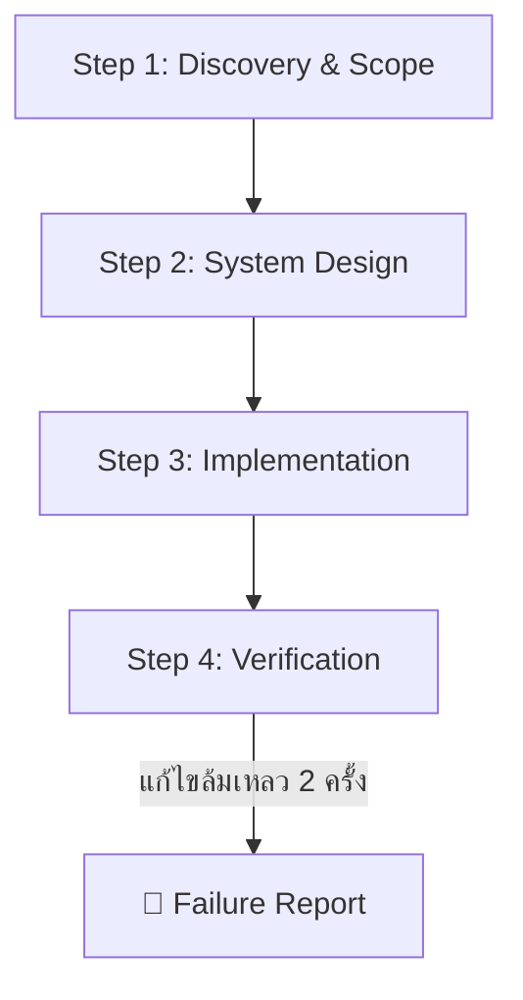

# ⚡ Apex — Production AI Agent Behavioral Framework & Rule Engine

> **Global AI Agent Rules & Architecture Framework for Modern Software Engineering**
> สถาปัตยกรรม 3 ชั้นควบคุม AI Coding Agent (Google Antigravity, Cursor, Claude Code, Windsurf ฯลฯ) เพื่อการพัฒนาซอฟต์แวร์ระดับ Production-Ready

 

---

## 📌 ภาพรวมโปรเจกต์ (Project Overview)

**`Apex`** คือกรอบควบคุมพฤติกรรม (Behavioral Framework) และชุดสถาปัตยกรรมกฎระเบียบ (3-Tier Rule Architecture) สำหรับ AI Coding Agent ถูกออกแบบขึ้นเพื่อแก้ปัญหาพฤติกรรมของ AI ทั่วไป และยกระดับ AI ให้กลายเป็น **Pragmatic Engineering Partner** ที่ทำงานร่วมกับโปรแกรมเมอร์ได้อย่างมีประสิทธิภาพ ปลอดภัย และมีมาตรฐานสูงสุด

### 🎯 ปัญหาที่โปรเจกต์นี้เข้ามาแก้ไข (Problem & Solution)

| ❌ ปัญหาของ AI ทั่วไป (Generic AI Agent) | ✅ สิ่งที่ `Apex` บังคับให้ทำ (Pragmatic Agent) |
|---|---|
| **เป็น "Yes-Man":** เออออตามผู้ใช้แม้ไอเดียจะเสี่ยงหรือ Over-engineered | **Pragmatic Challenger:** กล้าท้าทาย ค้านอย่างมีเหตุผล พร้อมนำเสนอ Pros/Cons/Trade-offs |
| **Preamble & Fluff:** ชอบพูดคำทักทายไร้สาระ ("ได้ครับ", "ยินดีครับ") และเกริ่นยืดยาว | **Action-First (BLUF):** สรุปสาระสำคัญไว้ที่บรรทัดแรกสุด (Bottom Line Up Front) ตัดคำไร้สาระออก 100% |
| **Hallucination & Guesswork:** มโนชื่อไฟล์ หรือแอบข้ามไฟล์ที่หาไม่เจอ | **Zero Hallucination:** หากข้อมูลไม่ชัดเจนหรือไฟล์หาย จะ **"หยุดถามทันที"** ห้ามเดาเอาเอง |
| **Code Spaghetti / Buggy RBAC:** สับสนเรื่องการจัดการสิทธิ์หลายบทบาท หรือทำให้เกิด Hydration Error | **System Blueprints:** มีพิมพ์เขียวมาตรฐานสำเร็จรูป (`blueprints/`) ป้องกันบั๊กตั้งแต่ระดับโครงสร้าง |
| **แก้บั๊กวนลูปซ้ำซาก:** ทำผิดซ้ำในเรื่องเดิมที่เคยแก้ไปแล้วข้าม Session | **Stack-Aware Memory & Gotchas:** ดึงบทเรียนและข้อควรระวังข้ามโปรเจกต์มาเตือนล่วงหน้าตาม Tech Stack |
| **แก้บั๊กวนลูปไม่จบ:** แก้พังวนซ้ำไปเรื่อยๆ โดยไม่รายงานปัญหาที่แท้จริง | **Failure Report Protocol:** หากแก้ Error ล้มเหลวครบ 2 ครั้ง ต้องหยุดและส่งรายงาน Root Cause ทันที |

---

## 🏛️ สถาปัตยกรรมระบบ 3 ชั้น (The 3-Tier Rule Architecture)

ระบบถูกจัดระเบียบใหม่ตามหลัก Separation of Concerns เพื่อความเรียบง่ายและไม่ซ้ำซ้อน:

```text
Apex-core/
├── AGENTS.md                   # 🧠 [Tier 1: AI Brain & Orchestration] แม่บทควบคุมพฤติกรรมและ Workflow 4 ขั้น
├── README.md                   # 📖 คู่มือการใช้งานและคำแนะนำสำหรับนักพัฒนา
├── .gitignore                  # 🛡️ มาตรฐาน Ignore ป้องกัน Secrets & AI Artifacts
│
├── rules/                      # 📜 [Tier 2: Engineering Standards] กฎคุณภาพ 6 เสาหลัก
│   ├── 01-security-auth.md     # 🥇 ความปลอดภัย, Secrets, CSRF, CORS & Hard Gates
│   ├── 02-coding-standards.md  # 🥈 Strict TypeScript, Try-Catch, Naming & Git Conventions
│   ├── 03-system-architecture.md# 🥉 Pragmatic Monolith, RESTful API Standards & Presets
│   ├── 04-database-design.md   # Prisma Schema, Migrations & Safe Seeding Dispatcher
│   ├── 05-ux-ui-design.md      # Component Layering 4 ชั้น, Tailwind CSS & Performance
│   └── 06-testing-devops.md    # Vitest/Playwright, Docker Multi-Stage & Structured Logging
│
├── skills/                     # 🧰 [Specialized AI Skills] ชุดสกิลผู้เชี่ยวชาญเฉพาะด้าน 7 ตัว
│   ├── codebase-cartographer/  # 🧭 สำรวจและรื้อฟื้นบริบทโปรเจกต์เก่าที่ทิ้งไว้นาน
│   ├── database-architect/     # 🗄️ จูน Query, Prisma Index & ป้องกัน Deadlock
│   ├── design-taste-frontend/  # 🎨 คุมโทนสีพรีเมียม (HSL) & Anti-Cliché UI
│   ├── docker-devops-master/   # 🐳 Multi-Stage Dockerfile & GitHub Actions CI/CD
│   ├── impeccable-audit/       # 🔍 Audit โค้ด, ความปลอดภัย (OWASP) & a11y
│   ├── sandbox-testing/        # 🧪 รัน Test Suite อัตโนมัติ & RBAC Persona Matrix
│   └── typescript-wizard/      # 🧙‍♂️ Strict TypeScript ไร้ Any สไตล์ Matt Pocock
│
├── scripts/
│   ├── scan-context.js         # ⚡ สคริปต์ Auto-Scan สร้างแผนผังบริบทโปรเจกต์ใน 1 วินาที
│   └── setup-git-shield.js     # 🛡️ สคริปต์ติดตั้งระบบป้องกัน .env และ Secrets Leak อัตโนมัติ
│
└── templates/                  # 📐 [Tier 3: Blueprints & Context Maps] พิมพ์เขียวพร้อมใช้
    ├── AI-Context-Index.md     # Single Source of Truth สรุปบริบทโปรเจกต์สำหรับ AI
    ├── gitignore-production.md # พิมพ์เขียว .gitignore มาตรฐานแยก AI & Secrets
    └── blueprints/
        ├── rbac-multi-role.md  # พิมพ์เขียวระบบ Multi-Role, 1-Click Quick Login & Dual-Layer Guards
        └── idempotent-webhook-receiver-with-hmac-signature.md # พิมพ์เขียว Webhook Receiver ปลอดภัย
```

---

### 📋 ตารางสรุป 6 เสาหลักมาตรฐานวิศวกรรม (Tier 2 Matrix)

| โมดูล | ขอบเขตหน้าที่ | หัวใจสำคัญ |
|---|---|---|
| **[`01-security-auth.md`](./rules/01-security-auth.md)** | Security & Protection | Zero Trust, `<secret:VAR_NAME>`, CSRF (Nuxt/Next.js), CORS Whitelist, Dev 404 Hard Gate |
| **[`02-coding-standards.md`](./rules/02-coding-standards.md)** | Code Quality & Git | Strict TS (No `any`), Try-Catch Log Origin, Conventional Commits, Solo-Dev Push Rule |
| **[`03-system-architecture.md`](./rules/03-system-architecture.md)** | System & API Design | Pragmatic Monolith, Ask before Diagram, RESTful Standards, Zod Validation, Idempotency |
| **[`04-database-design.md`](./rules/04-database-design.md)** | Database & Seeding | Prisma Safe Migrations, Central Seed Dispatcher (`seed.ts`), Soft Delete Cascade |
| **[`05-ux-ui-design.md`](./rules/05-ux-ui-design.md)** | Frontend & UX/UI | Component 4 Layers, Mobile-first Tailwind, Nuxt UI & Shadcn, Bundle < 200KB |
| **[`06-testing-devops.md`](./rules/06-testing-devops.md)** | QA, Docker & Logging | Vitest, Test DB Isolation, Docker Multi-Stage, GitHub Actions CI/CD, Structured Pino Logs |

---

### 🧰 ชุดสกิลผู้เชี่ยวชาญเฉพาะด้าน 7 ตัว (Specialized Skills)

| หมวดหมู่ | Skill Name | ลิงก์ไฟล์ | หน้าที่สำคัญ |
|---|---|---|---|
| 🧭 **Onboarding & Exploration** | `codebase-cartographer` | [`SKILL.md`](./skills/codebase-cartographer/SKILL.md) | สำรวจสถาปัตยกรรมด้วย Graded Pass (Scan/Focus/Full), Evidence-First Taxonomy, สแกน Git, Prisma, Routes และออกรายงาน **Project Executive Brief** |
| 🎨 **Frontend & UI/UX** | `design-taste-frontend` | [`SKILL.md`](./skills/design-taste-frontend/SKILL.md) | คุมโทนสีพรีเมียม (สัดส่วน 60-30-10 & HSL), Typography tracking, และหลีกเลี่ยง UI เชยๆ |
| 🧙‍♂️ **Code Quality & Typing** | `typescript-wizard` | [`SKILL.md`](./skills/typescript-wizard/SKILL.md) | สไตล์ **Matt Pocock** (Total TypeScript), Discriminated Unions, Zod Inference, กำจัด `any` 100% |
| 🗄️ **Database & Performance** | `database-architect` | [`SKILL.md`](./skills/database-architect/SKILL.md) | แก้ปัญหา N+1 Query ด้วย `include`/`select`, วาง Index (`@@index`), ป้องกัน Deadlock ด้วย `$transaction` |
| 🧪 **QA & Verification** | `sandbox-testing` | [`SKILL.md`](./skills/sandbox-testing/SKILL.md) | สร้าง Sandbox Test Suite รันเทสต์เร็วใน 1 วินาที, ตรวจสอบ RBAC Matrix ทุก Role, และทำ DB Rollback |
| 🔍 **Audit & Pre-flight** | `impeccable-audit` | [`SKILL.md`](./skills/impeccable-audit/SKILL.md) | Dual-Baseline Architecture Audit (Framework + Project Patterns), ตรวจสอบ Accessibility (WCAG 2.1 AA), และสแกนช่องโหว่ OWASP/IDOR |
| 🐳 **DevOps & Infrastructure** | `docker-devops-master` | [`SKILL.md`](./skills/docker-devops-master/SKILL.md) | Multi-stage Dockerfile ขนาดจิ๋ว ปลอดภัยด้วย Non-root user, Docker Compose, และ GitHub Actions CI/CD |

---

## 🤖 Core AI Workflow (กระบวนการทำงาน 4 ขั้นตอน)

Agent ทุกตัวที่รันภายใต้กรอบนี้ จะต้องปฏิบัติตามลำดับ 4 ขั้นตอนอย่างเคร่งครัด:



1. **Step 1: Discovery & Scope (วิเคราะห์ขอบเขต & Memory Recall):** 
   - วิเคราะห์ Requirements และ Existing Codebase
   - **Stack-Aware Gotchas Recall:** ตรวจสอบ Tech Stack ของโปรเจกต์ แล้วโหลดเฉพาะ Gotchas จากคลังความรู้ที่มี Tag ตรงกัน (`stack/nuxt4`, `stack/react`, `stack/universal`) เพื่อป้องกันความผิดพลาดซ้ำซากโดยไม่เปลือง Token
   - ค้นหา Test Runner ประจำโปรเจกต์ และประเมินความเสี่ยง
2. **Step 2: System Design - The 9arm Way (ออกแบบระบบ):** ออกแบบระบบด้วยหลักความเรียบง่ายที่สเกลได้ (Pragmatic & Simple) สอดคล้องกับ System Blueprint และถามผู้ใช้ก่อนวาด Diagram
3. **Step 3: Implementation (ลงมือเขียนโค้ด):** เขียนโค้ดจริง 100% (ห้ามมี Placeholder Code) ตามมาตรฐาน 6 เสาหลักใน `rules/`
4. **Step 4: Verification & Closed-Loop Memory (Universal DoD):**
   - ตรวจสอบผ่าน Test Runner หรือ Ad-hoc Verification (Type Check/Rollback Assertion) พร้อมแนบหลักฐาน (Terminal Output / Diff Review) ก่อนส่งงานเสมอ
   - **Closed-Loop Gotchas Capture:** เมื่อแก้บั๊กยากระดับสถาปัตยกรรมสำเร็จ หรือได้รับคำทักท้วง (User Correction) ให้บันทึก Gotchas สั้น ๆ 3 บรรทัดลงในคลังความรู้ทันที

---

## 🚀 วิธีการนำไปใช้งาน (How to Use & Integration Guide)

### 1. ติดตั้งแบบ Clean Architecture (รวบ AI ใน `.apex/` ไม่รก Root)
1. ติดตั้ง Apex เข้าสู่โปรเจกต์ของคุณด้วยคำสั่งเดียว:
   ```bash
   node /path/to/Apex-core/scripts/install-apex.js /path/to/your-project
   ```
   *(หรือใส่ `--stealth` หากต้องการซ่อนไฟล์ AI จากเพื่อนร่วมทีมผ่าน Git Exclude)*

2. **โครงสร้างหลังการติดตั้ง (Clean Root Layout):**
   ```text
   your-project/
   ├── 🧠 AGENTS.md                  # แม่บท AI บางๆ ชี้เข้า .apex/rules/
   ├── 🗺️ AI-Context-Index.md        # แผนที่บริบทโปรเจกต์ (JIT Context)
   │
   ├── 📦 .apex/                     # 🛡️ รวม Governance & Rules ทั้งหมดไว้ที่นี่!
   │   ├── rules/                   # กฎ 6 เสาหลัก
   │   ├── skills/                  # Specialized Skills
   │   ├── templates/               # Blueprints & Templates
   │   └── scripts/                 # Context Scanner & Git Shield
   │
   ├── 💻 app/ / src/                # 🟢 Source Code ของแอป สะอาด 100%
   └── ⚙️ package.json
   ```
3. AI Agent (Google Antigravity, Cursor, Windsurf, Claude Code) จะอ่าน `AGENTS.md` ที่ Root และโหลดกฎย่อยใน `.apex/` มาใช้อัตโนมัติในทุกๆ Task

---

## 🏛️ สถาปัตยกรรมคู่หู: Apex & Nexus 2.0 (The Twin-Engine Synergy)

ระบบถูกออกแบบให้ทำงานร่วมกันเป็น **Developer Productivity & AI Agent Ecosystem** แบ่งหน้าที่กันอย่างชัดเจนตามหลัก Single Responsibility:

```text
┌─────────────────────────────────────────────────────────────────┐
│         🤖 Developer Productivity & AI Agent Framework          │
├────────────────────────────────┬────────────────────────────────┤
│ ⚡ Apex (Rules & Engine)       │ 🏛️ Nexus 2.0 (Memory Vault)   │
│ (Rules & Behavioral Engine)    │ (Context & Engineering Memory) │
├────────────────────────────────┼────────────────────────────────┤
│ • 6 เสาหลักมาตรฐานวิศวกรรม     │ • Cross-Project Memory Vault   │
│ • Strict TS (Matt Pocock)      │ • Stack-Aware Gotchas Library  │
│ • Universal Definition of Done │ • JIT Context Compiler         │
│ • 🛡️ Git Shield ป้องกันหลุด    │ • 8 MCP Tools เชื่อมทุก IDE    │
└────────────────────────────────┴────────────────────────────────┘
```

### 🔗 เชื่อมต่อกับ Nexus 2.0
- **Repository:** 👉 [AlmxndBL/nexus](https://github.com/AlmxndBL/nexus)
- **เมื่อใช้งานร่วมกัน:** Nexus 2.0 จะทำหน้าที่เป็นสมองความจำระยะยาว เสิร์ฟบริบทโปรเจกต์ (JIT Context) และคลัง **Stack-Aware Gotchas** ผ่าน Universal MCP Server
- **100% Standalone Ready:** หากไม่มี Nexus 2.0 ระบบ `Apex` จะ Fallback ไปใช้กฎมาตรฐานใน `rules/` ได้อย่างสมบูรณ์แบบโดยไม่มี Error ใด ๆ


---

## 💖 Acknowledgements & Inspirations (ที่มาของแนวคิดและแรงบันดาลใจ)

Framework นี้เกิดขึ้นจากการสังเคราะห์และผสานรวมแนวคิดทางวิศวกรรมซอฟต์แวร์และ AI Agent Patterns ขอขอบคุณ Repositories และผู้นำทางความคิดที่เป็นต้นแบบแรงบันดาลใจสำคัญ:

- **🧙‍♂️ [Matt Pocock (Total TypeScript)](https://github.com/mattpocock/skills)** — แรงบันดาลใจสำหรับ `skills/typescript-wizard` ในการวางมาตรฐาน Strict Type-Safe, Discriminated Unions, Type Narrowing และ Zero `any` Policy
- **🎯 [The 9arm Way (Pragmatic Engineering)](https://github.com/jirayu-ct-dev/9arm-skills)** — ปรัชญาการออกแบบระบบที่เรียบง่ายแต่สเกลได้จริง (Pragmatic Monolith), การประเมิน Trade-off และการไม่ Over-engineer เกินความจำเป็น
- **🧠 [Andrej Karpathy Skills Pattern](https://github.com/multica-ai/andrej-karpathy-skills)** — แรงบันดาลใจของแนวคิดการจัดโครงสร้าง Agent Skill และ System Prompt Engineering


