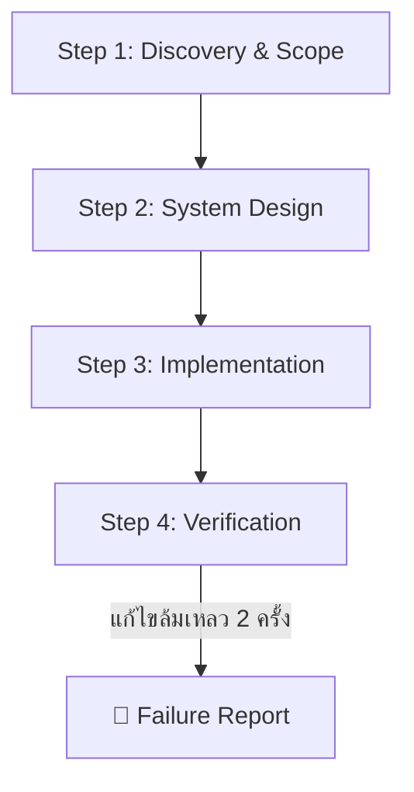

# 🧠 Agent Skill & Master Configuration Framework

> **Global AI Agent Rules & Architecture Framework for Modern Software Engineering**
> สถาปัตยกรรมและกรอบแนวคิดควบคุม AI Coding Agent (Google Antigravity, Cursor, Claude Code, Windsurf ฯลฯ) เพื่อการพัฒนาซอฟต์แวร์ระดับ Production-Ready

 

---

## 📌 ภาพรวมโปรเจกต์ (Project Overview)

**`agent-skill`** คือกรอบควบคุมพฤติกรรม (Behavioral Framework) และชุดกฎระเบียบ (Rule Architecture) สำหรับ AI Coding Agent ถูกออกแบบขึ้นเพื่อแก้ปัญหาพฤติกรรมของ AI ทั่วไป และยกระดับ AI ให้กลายเป็น **Pragmatic Engineering Partner** ที่ทำงานร่วมกับโปรแกรมเมอร์ได้อย่างมีประสิทธิภาพ ปลอดภัย และมีมาตรฐานสูงสุด

### 🎯 ปัญหาที่โปรเจกต์นี้เข้ามาแก้ไข (Problem & Solution)

| ❌ ปัญหาของ AI ทั่วไป (Generic AI Agent) | ✅ สิ่งที่ `agent-skill` บังคับให้ทำ (Pragmatic Agent) |
|---|---|
| **เป็น "Yes-Man":** เออออตามผู้ใช้แม้ไอเดียจะพังหรือเสี่ยงต่อ Security | **Pragmatic Challenger:** กล้าท้าทาย ค้านอย่างมีเหตุผล พร้อมนำเสนอข้อดี/ข้อเสีย (Pros/Cons/Trade-offs) |
| **Preamble & Fluff:** ชอบพูดคำทักทายไร้สาระ ("ได้ครับ", "ยินดีครับ") และเกริ่นยืดยาว | **Action-First (BLUF):** ตอบสรุปสาระสำคัญไว้ที่บรรทัดแรกสุด (Bottom Line Up Front) ตัดคำไร้สาระออก 100% |
| **Hallucination & Guesswork:** มโนชื่อไฟล์ หรือแอบข้ามไฟล์ที่หาไม่เจอ | **Zero Hallucination:** หากข้อมูลไม่ชัดเจนหรือไฟล์หาย จะ **"หยุดถามทันที"** ห้ามเดาเอาเอง |
| **Code Spaghetti / Monolithic Component:** เขียนโค้ดกระจุกในไฟล์เดียว หรือมี Infinite Loop Bug | **Strict Architecture:** บังคับจัดโครงสร้าง Feature-driven / Component Layering อย่างเป็นระบบ |
| **แก้บั๊กวนลูปไม่จบ:** แก้พังวนซ้ำไปเรื่อยๆ โดยไม่รายงานปัญหาที่แท้จริง | **Failure Report Protocol:** หากแก้ Error ล้มเหลวครบ 2 ครั้ง ต้องหยุดและส่งรายงาน Root Cause ทันที |

---

## 🤖 Core AI Workflow (กระบวนการทำงาน 4 ขั้นตอน)

Agent ทุกตัวที่รันภายใต้กรอบนี้ จะต้องปฏิบัติตามลำดับ 4 ขั้นตอนอย่างเคร่งครัด:

1. **Step 1: Discovery & Scope (วิเคราะห์ขอบเขต):**
   - วิเคราะห์ Requirements, Existing Codebase, Non-functional Requirements (Performance, Security, SLA) และประเมินความเสี่ยงก่อนลงมือเขียนโค้ด
2. **Step 2: System Design - The 9arm Way (ออกแบบระบบ):**
   - ออกแบบระบบด้วยหลักความเรียบง่ายที่สเกลได้ (Pragmatic & Simple)
   - **Frontend / UI Sub-step:** เลือก Architectural Preset (**SaaS Dashboard App Shell** หรือ **Marketing Sectional Layout**) พร้อมวางแผน Component Tree เสนอผู้ใช้ก่อนเสมอ
3. **Step 3: Implementation (ลงมือเขียนโค้ด):**
   - เขียนโค้ดจริง 100% (ห้ามมี Placeholder Code)
   - จัดโครงสร้างไฟล์แบบ Layered / Feature-driven (`layouts/`, `pages/`, `features/`, `components/ui/`)
4. **Step 4: Verification (การตรวจสอบ):**
   - ทำ Bounded Loop (Build $\rightarrow$ Lint $\rightarrow$ Test) จนมั่นใจว่าทำงานได้จริง

---

## 🧱 โครงสร้างสถาปัตยกรรมกฎ (Rule Architecture & Modules)

โปรเจกต์นี้จัดวางโครงสร้างแบบ **Modular Architecture** เพื่อความสะดวกในการนำไปใช้และบำรุงรักษา:

### 📄 1. Master Configuration File
- 🌐 **[`AGENTS.md`](./AGENTS.md):** ไฟล์แม่บทหลักที่กำหนด Persona, Priority Order, 4-Step Methodology, Failure Report Protocol และ Rule Loading Matrix

### 🔒 2. Domain Rule Modules (12 กฎเฉพาะทางในโฟลเดอร์ `rules/`)

ลำดับความสำคัญของกฎเมื่อเกิดข้อขัดแย้งกัน (Priority Order):

1. 🥇 **[`security-and-auth.md`](./rules/security-and-auth.md):** กฎความปลอดภัยระดับสูงสุด (Zero Trust, CORS, CSP, Rate Limit, CSRF, Session, File Upload)
2. 🥈 **[`coding-standards.md`](./rules/coding-standards.md):** มาตรฐานการเขียนโค้ด (Strict TypeScript, Error Handling, Naming Conventions, Async)
3. 🥉 **[`api-guidelines.md`](./rules/api-guidelines.md):** มาตรฐานการออกแบบ REST API (Idempotency, Validation, Pagination, Error Responses)
4. 🗄️ **[`database-design.md`](./rules/database-design.md):** สถาปัตยกรรมฐานข้อมูล (Prisma, PostgreSQL, Migrations, Connection Pooling, Soft Delete)
5. 🎨 **[`ux-ui.md`](./rules/ux-ui.md):** มาตรฐาน Frontend UI (Component Layering, App Shell Layout, Tailwind CSS, Nuxt UI, Anti-patterns)
6. 🏛️ **[`design-system.md`](./rules/design-system.md):** หลักการออกแบบระบบ (Pragmatic Monolith, Trade-off Analysis, Dependency Management)
7. 🧪 **[`testing-standards.md`](./rules/testing-standards.md):** มาตรฐานการทดสอบ (Unit Test, Integration Test, Test Data Isolation)
8. 📊 **[`observability.md`](./rules/observability.md):** ระบบติดตามและบันทึกข้อมูล (Structured Logging, Sentry, Health Checks)
9. ⚡ **[`performance.md`](./rules/performance.md):** การวัดผลประสิทธิภาพ (Web Vitals, API SLA, Caching Strategy, Bundle Budget)
10. 🐳 **[`infrastructure.md`](./rules/infrastructure.md):** โครงสร้างพื้นฐานและการติดตั้ง (Docker Compose, Production Environment, CI/CD)
11. 🔀 **[`git-conventions.md`](./rules/git-conventions.md):** มาตรฐานการจัดการ Git (Conventional Commits, Branch Strategy, Code Review)
12. 📝 **[`documentation.md`](./rules/documentation.md):** มาตรฐานการเขียนเอกสาร (README, API Docs, ADRs, Code Comments)

---

## 🚀 วิธีการนำไปใช้งาน (How to Use & Integration Guide)

### สำหรับ Google Antigravity / Cursor / Windsurf
1. คัดลอกไฟล์ [`AGENTS.md`](./AGENTS.md) และโฟลเดอร์ [`rules/`](./rules) ไปไว้ที่ **Root Directory** ของโปรเจกต์คุณ
2. AI Agent จะอ่านและโหลดกฎใน `AGENTS.md` และดึงกฎย่อยใน `rules/` มาใช้อัตโนมัติในทุกๆ Task

### สำหรับ Claude Code
- นำเนื้อหาหลักใน [`AGENTS.md`](./AGENTS.md) ไปใส่ไว้ในไฟล์ `CLAUDE.md` ที่ Root ของโปรเจกต์

---

## ⚙️ Primary Technology Stack Support

กรอบแนวคิดนี้ออกแบบมาให้รองรับทุก Tech Stack แต่มี **Default Presets** ที่พร้อมใช้งานทันทีสำหรับ:
- **Full-stack:** Nuxt 4 + Nitro + Vue 3
- **Database / ORM:** PostgreSQL + Prisma ORM
- **Styling & UI:** Tailwind CSS + Nuxt UI / React Tailwind
- **DevOps:** Docker + Docker Compose
