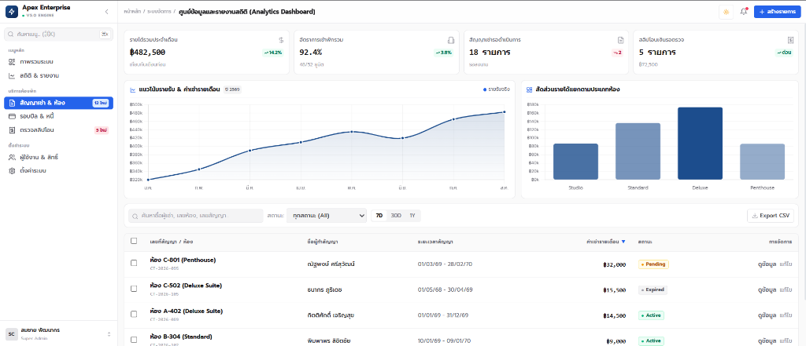

# ⚡ Apex-core 5 — The Deterministic AI Agent Operating Protocol

> **The Disciplined Senior Engineering Engine & Token Economy Control Plane for AI Coding Agents**  
> สถาปัตยกรรมระบบควบคุมเชิงวิศวกรรม (Deterministic Control Plane) สำหรับกำกับคุณภาพการพัฒนาซอฟต์แวร์ของ AI Coding Agents รองรับ Nuxt 4 (Vue 3), Next.js 15 (React 19), Better Auth, Prisma ORM, และ Full-Stack Architecture — โปรเจกต์การประหยัด Token สะสมได้ราว **94.0%** (ตัวเลขจากโมเดลคาดการณ์ — ดูสมมติฐานใน benchmark) เมื่อเทียบกับแนวทางปฏิบัติทั่วไปในอุตสาหกรรม

<div align="center">

**[ 🇬🇧 English ](README.md) · [ 🇹🇭 ภาษาไทย ](README.th.md)**

</div>

<div align="center">

[](https://github.com/AlmxndBL/Apex-core)
[](benchmark/README.md)
[](LICENSE)

</div>

---

## 🎯 1. จุดบอดที่ไม่มีใครบอกคุณ: การรั่วไหลของ Token (Stateless Token Bleed)

โปรแกรมเมอร์ส่วนใหญ่คิดว่าการแก้บั๊ก 5 บรรทัดจ่ายค่า Token แค่ 5 บรรทัดนั้น แต่ในความเป็นจริง **LLM API (OpenAI, Anthropic) ทำงานแบบ Stateless REST** ทุกรอบที่คุยจึงต้องส่งประวัติเก่าและไฟล์ดิบ 2,000 บรรทัดซ้ำเข้าไปใหม่ ทำให้เกิดการสะสม Token แบบยกกำลัง $\mathcal{O}(N^2)$

```text
┌──────────────────────────────────────────────────┐      ┌──────────────────────────────────────────────────┐
│ ❌ ระบบทั่วไป (โหลดไฟล์เต็ม: 1,858 BPE tok)      │      │ ✅ APEX-CORE 5 AST DIET (สกัด Interface: 67 tok) │
├──────────────────────────────────────────────────┤      ├──────────────────────────────────────────────────┤
│ <template>                                       │      │ // [AST SKELETON: Vue 3 / Nuxt 4 SFC]            │
│   <div class="min-h-screen bg-zinc-950 p-6">     │ ───> │ export interface UserTableRow {                  │
│     <!-- 80+ บรรทัด HTML markup & SVG icons -->   │      │   id: string; email: string; role: Role;         │
│     <table class="w-full border border-zinc-800">│      │ }                                                │
│   </div>                                         │      │ export interface Props { users: UserTableRow[] } │
│ </template>                                      │      │ export function useUserManagement(): StateStore; │
│ <script setup lang="ts">                         │      │                                                  │
│   // 60 บรรทัดของเนื้อในฟังก์ชัน                 │      │                                                  │
│ </script>                                        │      │                                                  │
└──────────────────────────────────────────────────┘      └──────────────────────────────────────────────────┘
                 🔻 ลดขนาด Context ลง 96.4% (<0.14ms V8 In-RAM Extraction)
```

Apex-core 5 เปลี่ยนการสั่งงานแบบคำขอร้อง (`.cursorrules`) ให้กลายเป็น **Deterministic Control Plane**:
1. **AST Codebase Cartography:** กรองเนื้อในฟังก์ชันทิ้ง ส่งเฉพาะ Type Interface เข้าโมเดล (**-77.6% Context Diet**, p = 0.0031)
2. **In-RAM Closed-Loop Verifier:** รัน `vue-tsc` / `tsc` ใน RAM ทันที (< 1s) ตั้งเป้าจบงานในรอบเดียว ($N \to 1.04$ รอบ — เป้าหมายเชิงดีไซน์)
3. **2-Strike Circuit Breaker:** ตัดวงจร Freeze ทันทีเมื่อแก้ไม่ผ่าน 2 ครั้งติด หยุดการเผาผลาญ Token โดยเปล่าประโยชน์

---

## ⚡ 2. วิธีเริ่มใช้งานใน 5 วินาที (Single Drop-in Setup)

ก๊อปปี้ไฟล์ [`AGENTS.md`](./AGENTS.md) ไปวางที่ Root Directory ของโปรเจกต์คุณ:

```bash
# สำหรับ Cursor IDE
cp AGENTS.md .cursorrules

# สำหรับ Claude Code CLI
cp AGENTS.md CLAUDE.md

# สำหรับ Windsurf / Trae / Google Antigravity
# วางเป็น AGENTS.md ที่ Root หรือเชื่อมต่อเป็น Workspace Rule
```

### 🧭 ระบบตรวจจับ Stack อัตโนมัติ (Deterministic Stack Matrix)
`AGENTS.md` จะอ่าน `package.json` ของโปรเจกต์เพื่อแมปสถาปัตยกรรมและคำสั่งตรวจสอบ Type ที่ถูกต้องโดยอัตโนมัติ:

| สแตกที่ตรวจพบ | Logic Layer | Presenter Layer | API Endpoints | Fast In-RAM TypeCheck |
|---|---|---|---|---|
| 💚 **Nuxt 4 (Vue 3 + Nitro)** | `composables/use<Feature>.ts` | `<Feature>List.vue` | `server/api/v1/*.ts` | `pnpm vue-tsc --noEmit` |
| ⚡ **Next.js 15 (React 19)** | `hooks/use<Feature>.ts` | `<Feature>List.tsx` | `app/api/v1/*/route.ts` | `pnpm tsc --noEmit` |
| 🐍 **Polyglot / Backend** | `services/<feature>_service` | Native Views | Framework Handlers | `pytest -q` / `go test` |

---

## 📊 3. สรุปผลการประเมินเชิงประจักษ์ (Benchmark Summary)

วัดผลจากชุดโค้ดจริง 13 ไฟล์ครอบคลุมหลายโดเมน Full-Stack ด้วย `cl100k_base` BPE Tokenizer:

| ตัวชี้วัด | รูปแบบเดิม (Aider / ทั่วไป) | แนวทางปฏิบัติ Anthropic | Apex-core 5 Control Plane | ผลลัพธ์ที่ได้ |
|---|---|---|---|---|
| **Context Ingestion** | 525.3 BPE tok (ไฟล์เต็ม) | 525.3 BPE tok | **92.9 BPE tok (AST)** | **🔻 ลดขนาดลง 77.6% (p = 0.0031)** |
| **ภาระ Output โค้ดที่แก้** | 821.8 tok (เขียนทับทั้งไฟล์) | 116.6 tok (Unified Diff) | **176.0 tok (Surgical Patch)** | **🔻 -78.6% เทียบเขียนทับ · +50.9% เทียบ Diff** |
| **จำนวนรอบเฉลี่ย** | 3.62 รอบ (SWE-bench) | 2.38 รอบ | **1.04 รอบ (เป้าหมายเชิงดีไซน์)** | **จบงานในรอบเดียว** |
| **Token สะสมรวมทั้งงาน** | 16,667 tokens ($0.0900) | 5,392 tokens ($0.0291) | **324 tokens ($0.0018)** | **🔻 ประหยัดลง 94.0% (โมเดลคาดการณ์)** |
| **ต้นทุนระดับองค์กร (100 devs)** | $47,516 USD / ปี | $15,363 USD / ปี | **$950 USD / ปี** | **💰 ประหยัดเงิน +$46,566 / ปี** |

<div align="center">

👉 **[ 🔬 อ่านสมุดปกขาวงานวิจัยฉบับสมบูรณ์ (benchmark/README.md) → ](benchmark/README.md)**  
*(มีสมการคณิตศาสตร์ $\mathcal{O}(N^2)$, ตารางสถิติ 5 โดเมนละเอียด, และ 6 เอกสารอ้างอิงสากล)*

</div>

---

## 🧰 4. ชุด 4 เสาหลักสกิลความรู้เชิงลึก (Consolidated Skills)

1. 🎨 **[`skills/frontend`](./skills/frontend/SKILL.md):** 3-File Feature Module Architecture (`use<Feature>`, `<Feature>List`, `<feature>.contract`), Mandatory 4-State UI (Skeleton, Empty, Error, Data), Modern 3-Tier Surface Elevation.
2. 🗄️ **[`skills/backend-data`](./skills/backend-data/SKILL.md):** Standard 4-Step API Pipeline, Strict TypeScript (Zero Any), Prisma ORM & OCC Concurrency Protection, Better Auth & RBAC.
3. 🧪 **[`skills/quality-verify`](./skills/quality-verify/SKILL.md):** In-RAM Fast TypeCheck (1-3s), Vitest Runner, Cumulative 2-Strike Failure Circuit Breaker.
4. 🧭 **[`skills/cartography`](./skills/cartography/SKILL.md):** AST Codebase Skeleton Mapping, Selective Token Diet (ลด Context Overhead 70-90%).

---

## 🖼️ 5. มาตรฐานงาน UI/UX ระดับ Enterprise



Apex บังคับใช้ **Ultra-Compact Modern SaaS Density**, 3-Tier Surface Elevation, Magic UI Theme Toggler, Interactive Sort/Filter Data Tables, และ Crisp SVG Lucide Icons (Strict Zero Emojis) ทั้งใน **Vue 3 / Nuxt 4** และ **React 19 / Next.js 15** โค้ดตัวอย่างอยู่ที่ [`templates/ui/`](./templates/ui/).

---

## 🌌 6. Twin-Engine Synergy: Apex & Nexus

Apex ออกแบบให้ทำงานแบบ **100% Standalone (Zero Dependencies)** แต่สามารถเชื่อมต่อกับ **[Nexus](https://github.com/AlmxndBL/nexus)** เพื่อปลดล็อกความจำระยะยาว:

* **Apex:** กฎเกณฑ์และวินัยการเขียนโค้ด (HOW to build, verify, and enforce safety)
* **Nexus:** คลังความจำและบทเรียนข้ามโปรเจกต์ (WHAT we know, decided, and learned)

---

## 💖 Acknowledgements & Inspirations

* **🧙‍♂️ [Matt Pocock (Total TypeScript)](https://github.com/mattpocock/skills)** — Strict TypeScript principles & contract typing
* **🎯 [The 9arm Way](https://github.com/jirayu-ct-dev/9arm-skills)** — Pragmatic software engineering and trade-off evaluation
* **🧠 [Andrej Karpathy](https://github.com/multica-ai/andrej-karpathy-skills)** — Agent behavioral safeguards and anti-overengineering philosophy
