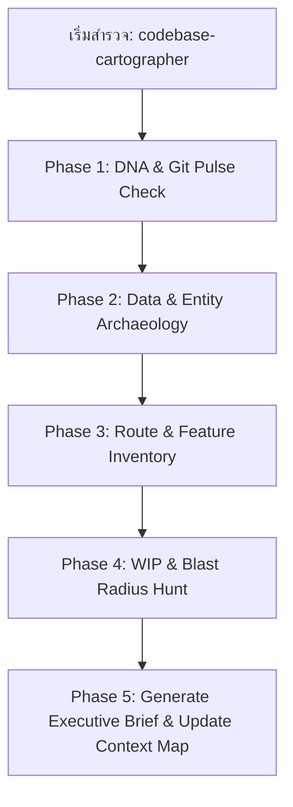

# 🧭 Codebase Cartographer & Project Onboarding Skill

> สกิลสำหรับการสำรวจ ถอดรหัสโครงสร้างโปรเจกต์ (Codebase Archaeology) และจัดทำแผนผังสถาปัตยกรรม (System Cartography) เมื่อกลับมาทำโปรเจกต์เดิมที่ทิ้งไว้นาน หรือรับช่วงต่อระบบที่ไม่คุ้นเคย โดยยึดหลัก **Evidence-First** และ **Right-Sized Pass Control**

---

## 🎯 เมื่อไหร่ที่ควรใช้ Skill นี้
- เมื่อผู้ใช้บอกว่า *"ไม่ได้แตะโปรเจกต์นี้นานแล้ว ช่วยดูให้หน่อยว่ามีอะไรบ้าง / ทำถึงไหนแล้ว"*
- เมื่อต้อง Onboarding เข้าสู่ Codebase ใหม่ หรือรับโปรเจกต์ Legacy มาพัฒนาต่อ
- เมื่อต้องการหาว่า **ฟีเจอร์ไหนทำเสร็จแล้ว, ฟีเจอร์ไหนยังค้างอยู่ (TODO/WIP), และรัศมีผลกระทบ (Blast Radius) ก่อนเริ่มงาน**

---

## 🚦 1. Right-Sized Pass Control (เลือกระดับการสแกน)

เพื่อป้องกัน **Document Bloat** และประหยัดเวลา Agent ต้องเลือกระดับการสแกนที่เล็กที่สุดและปลอดภัยที่สุด:

| Pass Mode | สถานการณ์ที่ใช้ | สิ่งที่ตรวจ | รูปแบบผลลัพธ์ (Artifact Budget) |
|---|---|---|---|
| ⚡ **Scan Mode** *(Default)* | งานเล็ก, สำรวจไว, ตรวจสอบ 1 จุด | Manifest, Git pulse ล่าสุด, โครงสร้างคร่าวๆ | **Compact Note 1 หน้าสั้นๆ** (เสร็จใน 15 วินาที) |
| 🎯 **Focus Mode** | ทำงานระดับ 1 โมดูล / 1 Feature / 1 Boundary | Data Flow, Caller Chains, และ Blast Radius ของโมดูลนั้น | **Targeted Boundary Map + Blast Radius Matrix** |
| 🏛️ **Full Mode** | Onboarding ระบบใหม่, รับงาน Legacy ทั้งระบบ, ทำ Handoff | สแกน 5-Phase เต็มรูปแบบ (Entities, Routes, WIP, Tests) | **Full Project Executive Brief + Completion Matrix** |

> [!IMPORTANT]
> **Promotion Gate:** ห้าม Agent เลื่อนขั้นเป็น Full Mode โดยเดาสุ่ม ต้องมี Trigger ชัดเจน (เช่น เป็น New Codebase, สัมผัส 3+ โมดูลพร้อมกัน, หรืองาน Database/Auth/Security ขนาดใหญ่)

---

## 🏷️ 2. Evidence Strength Taxonomy (มาตรฐานความแม่นยำของข้อมูล)

ทุกข้อสรุปในรายงานต้องระบุระดับความเชื่อมั่นอย่างชัดเจนเพื่อป้องกัน Hallucination:
- **`[Direct]`**: ข้อมูลที่ตรวจสอบจากไฟล์โค้ดหรือคอนฟิกจริง 100%
- **`[Inferred]`**: ข้อสรุปที่อนุมานจากโครงสร้างโฟลเดอร์ หรือความสัมพันธ์ แต่ยังไม่ได้อ่านซอร์สลึก
- **`[Assumed]`**: สมมติฐานการทำงานที่ยังรอการยืนยัน
- **`[Verify first]`**: จุดวิกฤตที่ต้องถาม Jack หรือตรวจสอบซ้ำก่อนลงมือแก้ไขจริง

---

## 🔍 3. The 5-Phase Archaeological Protocol (สำหรับ Full Mode)

Agent จะต้องดำเนินการสำรวจตามลำดับ 5 ขั้นตอนอย่างเป็นระบบ:



---

### 💓 Phase 1: DNA & Git Pulse Check (ตรวจชีพจรระบบ)
1. **สแกน Manifest Files:** ตรวจสอบ `package.json`, `requirements.txt`, `Dockerfile`, หรือ `docker-compose.yml` เพื่อระบุ:
   - Framework (Nuxt / Next.js / Vite / FastAPI / Express)
   - Database / ORM (PostgreSQL + Prisma / SQLite / MongoDB)
   - Port ที่ระบบรัน และ Environment Variables ที่จำเป็น (`.env.example`)
2. **ตรวจ Git Pulse ล่าสุด:**
   - รัน `git log -n 5 --oneline` เพื่อดูว่า 5 Commits ล่าสุดทำอะไรไป
   - รัน `git status` เพื่อดูว่ามีงานที่ค้าง Uncommitted หรือ Branch ไหนเปิดอยู่

---

### 🗄️ Phase 2: Data & Entity Archaeology (สำรวจหัวใจข้อมูล)
1. สแกนไฟล์ `prisma/schema.prisma` หรือโฟลเดอร์ `models/` / `database/`
2. ถอดรหัส Core Entities และความสัมพันธ์ (เช่น Users, Roles, Orders, Products, Transactions)
3. สรุปเป็นความสัมพันธ์แบบย่อว่าตารางไหนเป็นตารางหลัก และมี State Enum อะไรบ้าง

---

### 🧭 Phase 3: Route & Screen Inventory (สำรวจหน้าจอและ API)
1. สแกนโฟลเดอร์หน้าจอ (`pages/`, `views/`, `src/pages/`)
2. สแกนโฟลเดอร์ Backend Endpoints (`server/api/`, `app/api/`, `routes/`)
3. จัดกลุ่มตามบทบาทผู้ใช้ (User Roles) เช่น หน้าสำหรับ Admin, Staff, หรือ Customer

---

### 🚧 Phase 4: WIP & Blast Radius Hunt (ค้นหางานค้างและรัศมีผลกระทบ)
1. ค้นหาคำว่า `TODO:`, `FIXME:`, `HACK:`, `mock_data`, หรือฟังก์ชันว่างเปล่าที่ยังไม่ได้เขียนจริง
2. **Blast Radius Check:** ตรวจสอบว่าโมดูลหลักมีใครเรียกใช้บ้าง (Fan-in / Callers) เพื่อระบุความเสี่ยงก่อนแก้
3. ตรวจสอบว่าระบบมี Test Runner (`tests/`, `vitest.config.ts`) หรือไม่ และเทสต์ผ่านกี่เปอร์เซ็นต์
4. สรุปจุดที่ระบบยัง "ขาด" หรือ "ทำค้างไว้" อย่างตรงไปตรงมา (No Sugarcoating)

---

### 📋 Phase 5: Produce "Project Executive Brief" (ออกรายงานสรุป)
จัดทำรายงานสรุป 1 หน้าจบ และอัปเดตไฟล์ `AI-Context-Index.md` (หรือรัน `node scripts/scan-context.js`)

---

## 📄 โครงสร้างมาตรฐานของ Project Executive Brief

```markdown
# 🧭 Project Executive Brief: [ชื่อโปรเจกต์]

### 1. 📌 ภาพรวมระบบ (System Overview in 3 Lines)
- **วัตถุประสงค์:** [Direct] [อธิบายว่าระบบนี้ทำหน้าที่อะไร แก้ปัญหาอะไร]
- **Tech Stack:** [Direct] [เช่น Nuxt 4 + Nitro + Prisma + PostgreSQL + Docker]
- **สถานะล่าสุดจาก Git:** [Direct] [Commit ล่าสุดเมื่อไร และกำลังทำอะไรอยู่]

### 2. 🗄️ โครงสร้างข้อมูลหลัก (Core Domain Entities)
- **[Model A]:** [Direct] [คำอธิบายสั้นๆ และฟิลด์สำคัญ]
- **[Model B]:** [Direct] [คำอธิบายสั้นๆ และฟิลด์สำคัญ]

### 3. 📊 สถานะความพร้อมของฟีเจอร์ (Feature Completion Matrix)
| ฟีเจอร์ / โมดูล | หน้าจอ / Endpoint | สถานะความพร้อม | หลักฐาน / หมายเหตุ |
|---|---|---|---|
| **Auth & RBAC** | `/login`, `/api/auth` | ✅ เสร็จสมบูรณ์ (100%) | [Direct] รองรับ Role A, B, C |
| **Feature 1** | `/dashboard` | 🟡 อยู่ระหว่างพัฒนา (60%) | [Inferred] ขาดฟังก์ชัน Export PDF |
| **Feature 2** | `/api/checkout` | ❌ ยังไม่ได้เริ่ม (0%) | [Direct] พบ TODO ในโค้ด |

### 4. 🚀 วิธีรันและทดสอบระบบทันที (Quick Start)
- คำสั่งเริ่มระบบ: `pnpm dev` หรือ `docker compose up -d`
- รหัสผ่านสำหรับทดสอบ (Seeded Credentials): `[User] / [Password]`
- คำสั่งรันชุดทดสอบ: `pnpm test` หรือ `npx vitest run`

### 5. 🎯 สิ่งที่แนะนำให้ทำต่อทันที (Next Actionable Steps)
1. [งานสำคัญอันดับ 1 ที่ควรทำต่อ] `[Verify first: Yes/No]`
2. [งานสำคัญอันดับ 2 ที่ควรทำต่อ] `[Verify first: Yes/No]`
```
